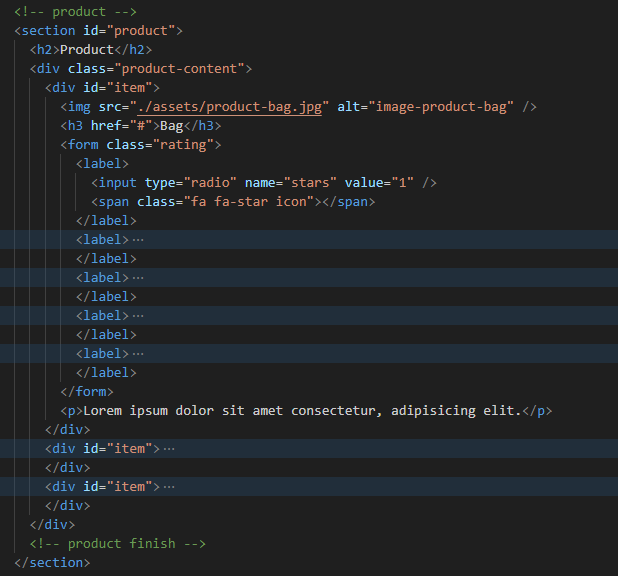

**List Asignment Milestone 1 :**

- [Company Profile domain](https://www.luv2read.site/)
- [Pembuatan Website](#documentation-how-to-build-my-website)
- [Deploy ke Custom Domain](#deploy-to-custom-domain)

### Documentation how to build My Website

1. first of all, I need to clone the repository where I'm gonna work on to my local.
   `gh repo clone revou-fsse-3/milestone-1-desyasarbini`
2. then start to connect every file to html such as css, responsive, and font-awsome.
   `<link rel="stylesheet" href="./style.css" />`
   `<link rel="stylesheet" href="./responsive.css" />`
   `<link
  rel="stylesheet"
  href="https://cdnjs.cloudflare.com/ajax/libs/font-awesome/6.4.2/css/all.min.css"
  integrity="sha512-z3gLpd7yknf1YoNbCzqRKc4qyor8gaKU1qmn+CShxbuBusANI9QpRohGBreCFkKxLhei6S9CQXFEbbKuqLg0DA=="
  crossorigin="anonymous"
  referrerpolicy="no-referrer"
/>`
3. start with the header code
   
   
4. then mainpage, about us section, and product section
   
   
   
   
5. lastly the footer
   
   

### Deploy To Custom Domain

1. Before deploy the project we need to make sure the repository already on public settings
2. add the code to the repository
   `git add .`
   `git commit -m "message"`
   `git push`
3. go to [vercel](https://vercel.com/) and login with your account
4. add the repo i'm working on, choose and wait
   
   
   
   
   
5. once it finish klik edit and input the domain name and finish.
